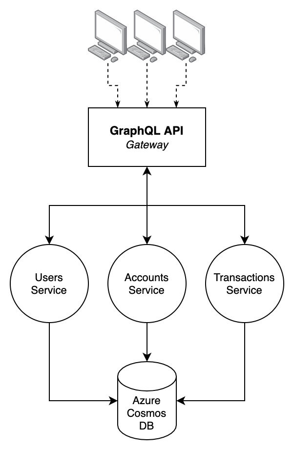

# CoalitionBank
> *A coalition is a group formed when two or more parties agree to work together, in a partnership to achieve a common goal.* &mdash; Thus, the CoalitionBank.

A hypothetical bank built using microservices. The purpose of this project is to demonstrate docker and kubernetes. In the light of that i didn't spend too much time on the application itself.

It's a simple application consisting of 4 services.
- **API service**
  - This is a GraphQL API. It acts as a gateway to the rest of the services. When a request is made to the API it makes one or more requests to the other services using gRPC.
- **Users service**
  - This is a gRPC service that serves remote procedure calls regarding users.
- **Transactions service**
  - This is a gRPC service that serves remote procedure calls regarding transactions.
- **Accounts service**
  - This is a gRPC service that serves remote procedure calls regarding accounts.

>
This is what the interaction between the services look like.

The services, except the api, utilize an Azure CosmosDB database for the purpose of storing data.

This project also utilizes Github actions to build and publish the different services as docker images to a private Azure Container Registry. In the same actions the various service deployments in the Kubernetes Cluster on Azure get incremented to the newest version. The actions get triggered when a new release is made of this repository.